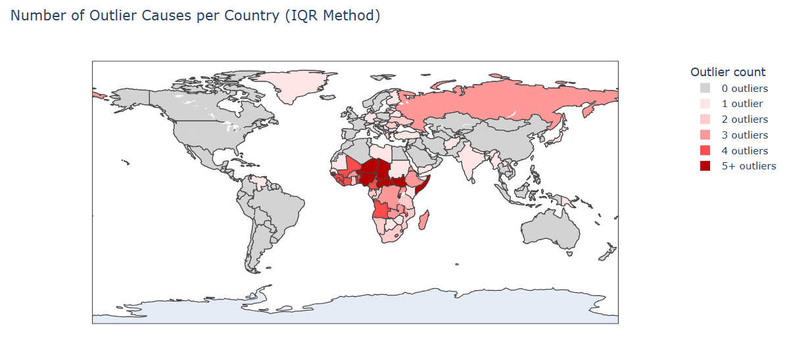

# Anomaly Detection in Global Burden of Disease Data

## Overview
This project explores country-level mortality patterns using data from the
Institute for Health Metrics and Evaluation (IHME) Global Burden of Disease (GBD)
study. Statistical and machine learning–based anomaly detection methods are applied
to identify countries with atypical cause-of-death profiles.

The analysis emphasizes careful interpretation of anomalies in a public health
context and demonstrates how multivariate methods can reveal patterns not visible
through univariate analysis alone.

## Data Source and Licensing
Source: Institute for Health Metrics and Evaluation (IHME). Used with permission.
All rights reserved.

This analysis uses Global Burden of Disease (GBD) 2023 estimates, released in
2025. The underlying data are not included in this repository due to licensing
restrictions.

All visualizations and results shown are derived outputs shared for non-commercial,
educational, and portfolio purposes in accordance with IHME’s Free-of-Charge
Non-Commercial User Agreement.

## Methods
- Exploratory Data Analysis (EDA)
- Interquartile Range (IQR)–based outlier detection
- Isolation Forest
- One-Class Support Vector Machine
- Principal Component Analysis (PCA)

## Preview

## Interactive Visualizations (Plotly)
- Interactive distribution of malaria and NTDs (histogram and boxplot):  
  https://fionaheerink.github.io/gbd-anomaly-detection/figures/hist_box_malaria_ntd.html
- Interactive distribution of diabetes and kidney disease (histogram and boxplot):  
  https://fionaheerink.github.io/gbd-anomaly-detection/figures/hist_box_diabetes_kidney.html
- World map of outlier counts (IQR method):  
  https://fionaheerink.github.io/gbd-anomaly-detection/figures/outlier_map_IQR.html
- PCA of mortality profiles + One-Class SVM anomalies:  
  https://fionaheerink.github.io/gbd-anomaly-detection/figures/pca_scatter_SVM.html
- World map of anomalous countries (One-Class SVM):  
  https://fionaheerink.github.io/gbd-anomaly-detection/figures/outlier_map_SVM.html
- World map of anomalous countries (Isolation Forest):  
  https://fionaheerink.github.io/gbd-anomaly-detection/figures/outlier_map_IF.html

## Tools
- Python
- pandas, numpy
- scikit-learn
- Plotly

## Repository Contents
- `Anomaly_detection_GBD.ipynb`: Main analysis notebook
- `docs/figures/`: Exported interactive Plotly visualizations (HTML)
